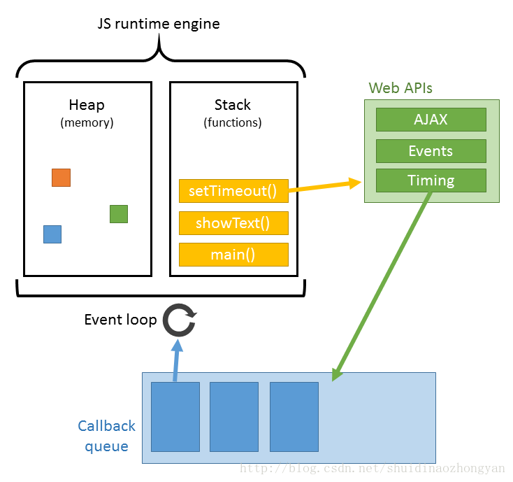

A fluent website is like a work of art.The veteran front-end develop must have knowledge of three areas: HTML, Javascript, and CSS. In addition to writing high-quality code, make sure that the relevant third-party code is of high quality.  

## 前言
本文主要針對瀏覽器對頁面的渲染——這一過程的描述及其背後原理的解釋。

清楚了解瀏覽器的渲染過程、渲染原理，也就掌握了指導原則。根據優化原則，可以實現出無數種具體的優化方案，各種預編譯、預加載、資源合並、按需加載方案都是針對瀏覽器渲染習慣的優化。

## 關鍵渲染路徑
**關鍵渲染路徑(Critical Rendering Path)** 是指與當前使用者操作有關的內容。例如使用者在瀏覽器送出了一個url，首頁的顯示就是當前用戶操作相關的內容，具體就是瀏覽器收到 HTML、CSS 和 JavaScript 等資源並對其進行處理從而渲染出 Web 頁面。

了解瀏覽器渲染的過程與原理，最終的目標是為了優化關鍵渲染路徑，因為優化是針對具體問題的解決方案，所以優化沒有一定的方法與途徑 。例如為了保障首屏內容的最快速顯示，通常會提到漸進式頁面渲染，但是為了漸進式頁面渲染，就需要做資源的拆分，那麽以什麽粒度拆分、要不要拆分，不同頁面、不同場景策略不同。如何決定具體的解決方案既要考慮使用者體驗問題，也要考慮前端開發問題。

## 瀏覽器渲染頁面的過程
即瀏覽器對內容的渲染，可以分為下面[三個步驟](https://developers.google.com/web/fundamentals/performance/critical-rendering-path/render-tree-construction)：

1) 解析  
- 處理 HTML 標記並構建 DOM 樹。  
- 處理 CSS 標記並構建 CSSOM 樹。  
- Javascript腳本，主要是通過DOM API和CSSOM API來操作DOM Tree和CSS Rule Tree。  

2.) 將 DOM 與 CSSOM 合拼成一個渲染樹   
- 去除一些沒必要放進Render Tree的東西，例如Header或display:none。  
- 將CSS Rule附加在Rendering Tree上的每個Element，也就是DOM結點，也被稱為Frame。  
- 計算每個Frame的位置，此步驟又稱為layout和reflow過程。  

3.) 通過調用Native GUI，將各個節點繪制到屏幕上。  

需要明白，這三個步驟並不一定一次性順序完成。如果 DOM 或 CSSOM 被修改，以上過程需要重覆執行，這樣才能計算出哪些像素需要在屏幕上進行重新渲染。實際頁面中，CSS 與 JavaScript 往往會多次修改 DOM 和 CSSOM。  

這個過程比較覆雜，涉及到兩個概念: reflow(回流)和repaint(重繪)。DOM節點中的各個元素都是以盒模型的形式存在，這些都需要瀏覽器去計算其位置和大小等，這個過程稱為reflow;當盒模型的位置,大小以及其他屬性，如顏色,字體,等確定下來之後，瀏覽器便開始繪制內容，這個過程稱為repaint。頁面在首次加載時必然會經歷reflow和repaint。reflow和repaint過程是非常消耗性能的，尤其是在移動設備上，它會破壞用戶體驗，有時會造成頁面卡頓。所以我們應該盡可能地減少reflow和repaint。  

## Javascript runtime engine

JS的解析是由瀏覽器中的JS解析引擎完成的。JS是單線程運行，也就是說，在同一個時間內只能做一件事，所有的任務都需要排隊，前一個任務結束，後一個任務才能開始。但是又存在某些任務比較耗時，如IO讀寫等，所以需要一種機制可以先執行排在後面的任務，這就是：同步任務(synchronous)和異步任務(asynchronous)。  

JS的執行機制就可以看做是一個主線程加上一個任務隊列(task queue)。同步任務就是放在主線程上執行的任務，異步任務是放在任務隊列中的任務。所有的同步任務在主線程上執行，形成一個執行棧;異步任務有了運行結果就會在任務隊列中放置一個事件；腳本運行時先依次運行執行棧，然後會從任務隊列裏提取事件，運行任務隊列中的任務，這個過程是不斷重覆的，所以又叫做事件循環(Event loop)。

瀏覽器在解析過程中，如果遇到請求外部資源時，如圖像,iconfont,JS等。瀏覽器將重覆1-6過程下載該資源。請求過程是異步的，並不會影響HTML文檔進行加載，但是當文檔加載過程中遇到JS文件，HTML文檔會掛起渲染過程，不僅要等到文檔中JS文件加載完畢還要等待解析執行完畢，才會繼續HTML的渲染過程。原因是因為JS有可能修改DOM結構，這就意味著JS執行完成前，後續所有資源的下載是沒有必要的，這就是JS阻塞後續資源下載的根本原因。CSS文件的加載不影響JS文件的加載，但是卻影響JS文件的執行。JS代碼執行前瀏覽器必須保證CSS文件已經下載並加載完畢。
## Reference
[How Browser works](http://taligarsiel.com/Projects/howbrowserswork1.htm)  
[轉譯樹狀結構的建構、版面配置和繪製](https://developers.google.com/web/fundamentals/performance/critical-rendering-path/render-tree-construction)  
[浏览器的渲染原理简介](https://coolshell.cn/articles/9666.html)  
[浏览器的渲染：过程与原理](https://zhuanlan.zhihu.com/p/29418126)

