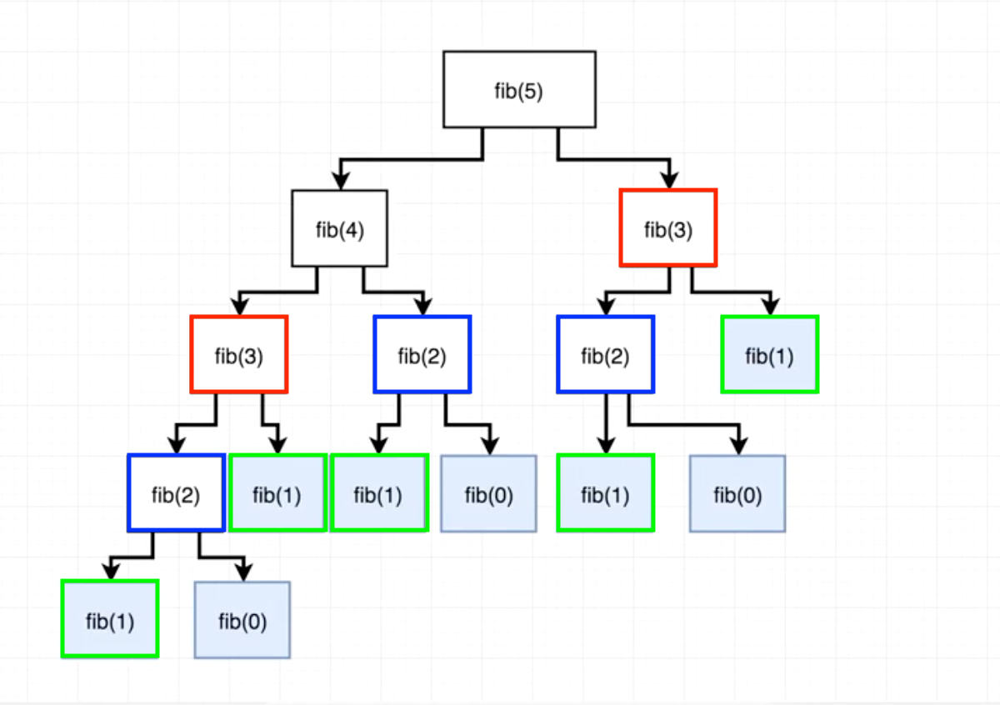

Fibonacci為1200年代的歐洲數學家，在他的著作中曾經提到：「若有一隻免子每個月生一隻小免子，一個月後小免子也開始生產。起初只有一隻 免 子，一個月後就有兩隻免子，二個月後有三隻免子，三個月後有五隻免子（小免子投入生產）......」。若是把兔子的總數目隨著時間變化以數列的形式表示，便可得到知名的費氏數列(Fibonacci sequence)。  

## Definition
“In mathematics, the Fibonacci numbers are the numbers in the following integer sequence, called the Fibonacci sequence, and characterized by the fact that every number after the first two is the sum of the two preceding ones.” -[Wikipedia](https://en.wikipedia.org/wiki/Fibonacci_number)  

依照上述定義，我們可以將費式數列表示為如下的數學式：  
F0 = 0  
F1 = 1  
Fn = Fn-1 + Fn-2   

## Solution
### 遞迴
費氏數列的解法很多，遞迴是其中一種方法，解法如下：
```javascript
function fib(n) {
    if (n < 2){
        return n
    }
    return fib(n - 1) + fib (n - 2)
}
```
遞迴解法的優點是美觀與直覺，缺點是有許多函式在遞迴的過式中被重覆呼叫，導致計算速度緩慢。以fib(5)展開圖為例，我們可以看到在遞迴的過程裡，fib(3)、fib(2)都被重覆計算，因此當fib(n)的n值越大時，以遞迴方式求值的所需要的時間越久。費氏數列的遞迴解之時間複雜度為O(n^2)  


### 迭代
第二種解法是透過迴圈迭代求解費氏數列，解法如下：  
```javascript
function fib(n){
    if(n<2){
        return n;
    }
    let tmp=0;
    let prev=0;
    let curr=1;
    for(let i=2;i<=n;i++){
        temp=curr;
        curr=prev+curr;
        prev=temp;
    }
    return curr;
}
```
也可以用array的方式求解：
```javascript
function fib(n){
  let arr = [0, 1];
  for (let i = 2; i < n + 1; i++){
    arr.push(arr[i - 2] + arr[i -1])
  }
 return arr[n]
 }

```
迭代求解的時間複雜度為O(n)，優於遞迴解。

## Extended discussion
### 演算法公式解
此演算法的公式解，時間複雜度為O(logn)
```javascript
function fib(n){
    if(n<2){
        return n;
    }else{
        let i=n/2;
        f1=fib(i+1);
        f2=fib(i);
        if(n%2===0){
            return f2*(2*f1+f2);
        }else{
            return f1**2+f2**2;
        }
    }
}
```

### 記憶函數優化遞迴
使用記憶函數優化遞迴解：
```javascript
function cache(fn){
  var r = {}
  return function(n){
    if(r[n] == null){
      r[n] = fn(n)
      return r[n]
    }else{
        return r[n]
    }
  }
}

var fib = cache(function(n){
    if(n==0){
        return 0
    }else if(n==1){
        return 1
    }else{
        return fib(n-1) + fib(n-2)
    }
})
```
### 遞迴解參數化
去除遞迴解的重覆計算部份，重新改寫fib函數，把費氏數列的前兩個值參數化，：
```javascript
function fib(n){
  function fib_(n,a,b){
    if(n==0)  return a
    else return fib_(n-1,b,a+b)
   }
   return fib_(n,0,1)
}
```
