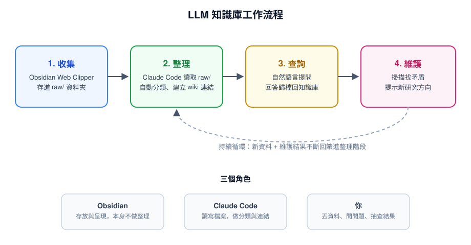

**TL;DR：** 知識管理真正累人的地方不是讀資料、不是思考，而是把讀過的東西**整理**成之後找得到、串得起來的樣子。過去這件事只能靠人工慢慢分類、下標籤、建連結；現在可以把「整理」這一步整個外包給 LLM，讓 Claude Code 直接讀寫你的筆記檔案，自動幫你分類、串連、維護。

## 問題：資料越存越多，但越來越找不到

大多數人累積知識的方式，是把文章存起來、零星做點筆記，但很少真的回頭把這些內容整理成有結構、彼此串連的東西——因為那太花時間了。結果就是資料庫越長越大，實際能用上的比例卻越來越低。

OpenAI 共同創辦人 Andrej Karpathy 前陣子公開分享了他的做法：把「整理」這個最耗人力、卻又最沒有創造性的步驟，交給 AI agent 去做。他靠這套流程在單一研究主題上累積了大約 100 篇互相串連的筆記，總字數約 40 萬字，而且還維持在可查詢、可維護的狀態。

## 心智模型：把 Claude Code 當成你的資料庫管理員

簡化來看，這套系統只有三個角色：

- **Obsidian**：本機的 markdown 筆記軟體，負責存放與呈現，本身不做任何智慧整理
- **Claude Code**：有檔案讀寫權限的 agent，實際做分類、下標籤、建立筆記之間的雙向連結（wiki-link）
- **你**：負責丟原始資料進去、問問題、偶爾檢查結果對不對

跟傳統筆記軟體最大的差別是：你不用自己決定「這篇文章該歸在哪一類」、「這個概念該連到哪些既有筆記」——這些原本要靠人腦做的分類決策，改成讓 Claude Code 讀完內容之後自己判斷、自己寫進 vault 裡。

## 實際運作：收集 → 整理 → 查詢 → 維護

具體拆成四個階段：

1. **收集（Collect）**：用 Obsidian Web Clipper 這個瀏覽器擴充功能，把看到的文章原封不動存進 vault 裡的 `raw/` 資料夾，先不做任何處理
2. **整理（Compile）**：讓 Claude Code 讀 `raw/` 裡的原始資料，依概念自動產生互相連結的 wiki 筆記——這一步取代的正是傳統上最耗時的人工分類
3. **查詢（Query）**：直接用自然語言問複雜問題，AI 讀完整個知識庫回答之後，把回答也歸檔回知識庫，變成新的一篇筆記
4. **維護（Maintain）**：定期讓 AI 掃過整個 vault，找出前後矛盾的地方，或是提示可能值得深入研究的新方向

整套系統的建置門檻也不高：把 Karpathy 公開的架構文件貼進 Claude Code，讓它照著說明自己把資料夾結構、規則檔案都建好即可，不用手動一步步設定。

## Trade-offs：這套做法不是沒有代價

- **需要付費訂閱**：Claude Code 需要 Claude Pro 方案，屬於持續性成本，不是免費工具鏈
- **內容正確性要自己把關**：AI 整理、下結論的過程仍可能出錯或過度概括，尤其是自動產生的跨筆記連結，值得定期抽查而不是完全信任
- **檔案讀寫權限是把雙面刃**：讓 agent 直接改寫你的知識庫檔案很方便，但代表你要能接受它偶爾整理錯、需要手動修正回去
- **適合資料量大、主題持續累積的場景**：如果只是偶爾記幾則零散筆記，這套自動化流程帶來的效益可能還不如手動整理的心力划算

## 總結

這套做法的核心其實不是「用了什麼工具」，而是一個更通用的想法：**知識管理裡最沒有創造性、最重複性的那一步（整理與串連），本來就是 LLM agent 擅長的事**，人力應該花在收集資料跟問問題這兩端，而不是中間的整理工作。Obsidian + Claude Code 只是目前一個具體可行的實作方式，換成別的 markdown 筆記軟體、換一個能讀寫檔案的 agent，邏輯是一樣的。

## Further Reading
- [LLM知識庫｜Obsidian+Claude Code打造超強知識管理系統](https://www.bnext.com.tw/article/90530/llm-knowledge-base-obsidian-claude-code) — 本文參考來源
