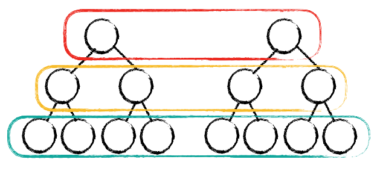
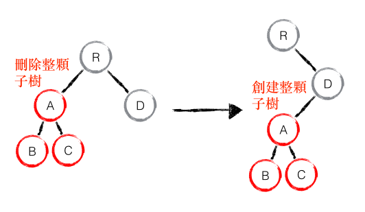
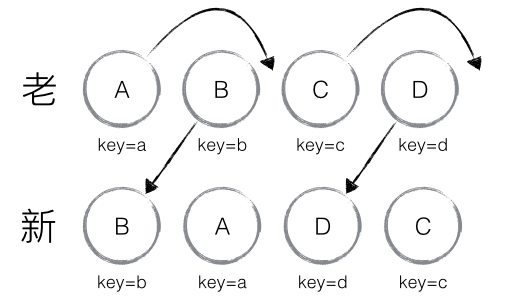
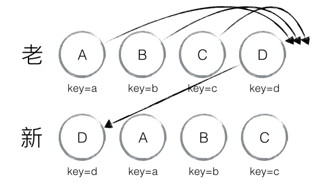

簡單整理有關 React Vitual DOM的面試題，同時釐清常被誤解的一些觀念，有空再回來補遣 Virtual DOM 的詳細介紹。

# 什麼是 Virtual DOM
**本質上是 JavaScript 對象，這個對象就是更加輕量級的對 DOM 的描述。**

# Virtual DOM 的好處有哪些？
## 不用操作實際的 DOM
更新 DOM 的流程需要以下兩個步驟
1. 遍歷 DOM 樹找到節點
2. 在有必要時更新這個節點。
當 DOM Tree 隨著專案越長越大，我們再去修改 DOM Tree 就越來越痛苦。  
第一是找節點並分析上下文的關係再去修改的過程耗時耗力，第二是效率極低，傳統 diff 算法的複雜度為 O(n^3)。

## 抽象了原本的渲染過程，實現了跨平台的能力
Virtual DOM 可以在沒有 DOM 樹的平台上使用，使得框架跨平台，Ex. node.js的SSR。

# Virtual DOM 的缺點
- 首次渲染大量 DOM 時，由於多了一層虛擬 DOM 的計算，會比 innerHTML 插入慢。
- 虛擬 DOM 需要在記憶體中維護一份 DOM 的副本。
- 如果虛擬 DOM 大量更改，這是合適的。但是單一的，頻繁的更新的話，虛擬 DOM 將會花費更多的時間處理計算的工作。所以，如果你有一個 DOM 節點相對較少頁面，用虛擬 DOM，它實際上有可能會更慢。

# 詳解 React diff
## 編輯距離 edit distance
> 在計算機語言和計算機科學中，編輯距離的定義為將一個字串轉化為另一個字串所需的最小操作數，通常用來量化兩個字串的差異程度。一般來說，操作包括：替換、插入和刪除。
[wiki: Edit distance](https://en.wikipedia.org/wiki/Edit_distance)

傳統的 diff 算法會將節點之間進行完全的比較，即新舊節點的父節點、本身和子節點進行遞迴比較，其時間複雜度為O(n^3)。

## React 策略
1. Web UI 中 DOM 節點跨層級的移動操作特別少，直接忽略不計。
2. 擁有相同父節點的兩個組件會生成相似的樹形結構，擁有不同類的兩個組件將會生成不同的樹形結構。
3. 對於同一層級的子節點，它們可以通過唯一 id 進行區分。

# 如何做性能優化
## 不要做跨層級移動
先來看 出現 DOM 節點跨層級的移動操作時， React diff 會有什麼反應。

如下圖， A 節點(包括其子節點)整個被移動到 D 節點之下。 由於 React 只會考慮同層級節點的位置變換，對於不同層級的節點，只有創建和刪除操 作，當根節點發現子節點中 A 消失了，就會直接銷毀 A ;當 D 發現多了一個子節點 A ，則會創建新的 A 以及 A 的子節點。

React diff 的執行過程為， create A -> create B -> create C -> delete A 。  
因此** React 官方建議不要進行 DOM 節點跨層級的操作**。
因此 React 官方建议不要进行 DOM 节点跨层级的操作。

> 注意： 在開發組件時，保持穩定的 DOM 結構有助於性能的提升。 例如，可過 CSS 隱藏或顯示節點，而不是真的移除或添加 DOM 節點。

## 避免將同層級的最後一個節點移到列表首位
當節點處於同一層級時，React 提出優化策略：允許開發者對同一層級的同組子節點，添加唯一 key 進行區分。同時React diff 提供了三種節點操作，分別為：INSERT_MARKUP（插入）、MOVE_EXISTING（移動）和 REMOVE_NODE（刪除）。若節點只是位置改變，則透過移動操作重複使用該節點，其他的情況才使用插入和刪除節點的操作。  

當然，React diff 還是存在些許不足與待優化的地方，如下圖所示，若新集合的節點更新為：D、A、B、C，與老集合對比只有 D 節點移動，而 A、B、C 仍然保持原有的順序，理論上 diff 應該只需對 D 執行移動操作，然而由於 D 在老集合的位置是最大的，導致其他節點的 _mountIndex < lastIndex，造成 D 沒有執行移動操作，而是 A、B、C 全部移動到 D 節點後面的現象。

> 建議：在開發過程中，盡量減少類似將最後一個節點移動到列表首部的操作，當節點數量過大或更新操作過於頻繁時，在一定程度上會影響 React 的渲染性能。

# Ref.
1. [Building a Simple Virtual DOM from Scratch](https://dev.to/ycmjason/building-a-simple-virtual-dom-from-scratch-3d05#mount-node-target)
2. [從頭打造一個簡單的 Virtual DOM](https://blog.techbridge.cc/2019/02/04/vdom-from-scratch/)
3. [Performance Comparison for React, Angular and Knockout](http://chrisharrington.github.io/demos/performance/)
4. [重新认识 Virtual DOM](https://juejin.im/post/5d3ff99fe51d4561fb04beea)
5. [面试官: 你对虚拟DOM原理的理解?](https://juejin.im/post/5d3f3bf36fb9a06af824b3e2)
6. [React 源码剖析系列 － 不可思议的 react diff](https://zhuanlan.zhihu.com/p/20346379)
7. [网上都说操作真实 DOM 慢，但测试结果却比 React 更快，为什么？](https://www.zhihu.com/question/31809713)
8. [深度剖析：如何实现一个 Virtual DOM 算法 #13](https://github.com/livoras/blog/issues/13)
9. [React Virtual DOM Postmortem](https://medium.com/@js_tut/react-animated-tutorial-7a46fa3c2b96)
10. [react的diff 从O(n^3)到 O(n) ，请问 O(n^3) 和O(n) 是怎么算出来？](https://www.zhihu.com/question/66851503)
