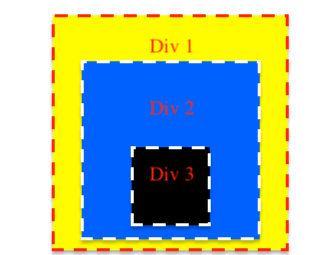

Front Interview Questions and Answers including javascript, css, vanilla.js and some situational problem.

# Question 1
Given a string and determine whether is a palindrome  
Example 1  
**Input**: aabbaa  
**Output**: true  

Example 2  
**Input**: abcde  
**Output**: false  

##Solution
```typescript
function isPalindrome(str: string): boolean{
    for(let i=0,j=str.length;i<j;i++,j--){
        if(str[i]!==str[j]){
            return false;
        }
    }
    return true;
}
``` 

# Question 2
Please refactor the followingCSS snippets
```css
.wrap .container .row{
    display: block;
    width: 100%;
    overflow: hidden;
    position: relative;
}
.wrap .container .row .column-1 .row{
    display: block;
    width: 100%;
    position: relative;
    border-bottom: 1px solid red;
}
.wrap .container .row .column-2 .container.flex{
    display: flex;
}
.wrap .container .row .column-3{
    font-size: 16px;
}
.wrap .container .row .column-3 .text {
    font-size: 16px;
    line-height: 20px;
}
.wrap .container .row .column-4 .darkContainer{
    background: rgba(0,0,0,0.5);
    display: block;
    width: 100%;
    position: relative;
}
```
# Question 3
By using native-js (vanilla JS) and simple CSS, please try to render an UI looks like this image below:  


# Question 4
There are following data need to save in **client-side storage**:  
    - User access token: **f706Ne%f|N]dy/[BisS^C2%J=/i8Ncx)#ZuyqDuGs**
    - User age: ** 25 **
    - User name:  ** George **
    - Video autoplay toggle: true
    - User search records: ["car", "android", "iphone" ...]
Please explain which client-side storage you will choo to store each item and __the reason__ compared with others.

# Question 4
We have 3 div elements, each of them has a click handler associated.

```html
<div class="div-1">
    <p>Div 1</p>
    <div class="div-2">
    <p>Div 2</p>
        <div class="div-3">
            <p>Div 3</p>
        </div>
    </div>
</div>
```
Please write code for assigning these event handlers in a way, that when Div is clicked, following sequence is printed in console:  
div-2->div-3->div-1

# Question 5
What happens after the browser receives the first HTML response from the server until the full page is displayed and cn be interactedwith?  
__Please  try to list the steps in order.__

# Question 6
Please share with us one frontend trending topic you are researching recently, what it is about and why.  
(answers can be simple.)  

example:  
svelte, a new frontend framework which can be compared with react/vuejs/angular.  

I'd like to study why it can be faster than other esistingframework and the benefit to apply into my current projects.
