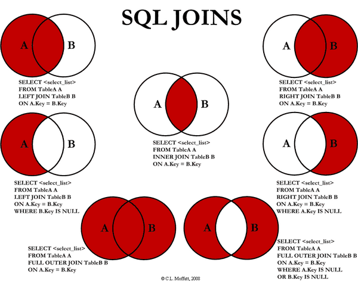

# What is a join?
JOIN是SQL的關鍵字之一，使用的情境是在多張Table之中Query資料。


舉例來說，我們有兩張Table如下，分別是Store_Information和Geography  

|Store_Information Table     |   |   |
|---|---|---|
|Store_Name|	Sales	|Txn_Date
Los Angeles|	1500	|05-Jan-1999
San Diego|	250	|07-Jan-1999
Los Angeles|	300	|08-Jan-1999
Boston|	700	|08-Jan-1999


|Geography Table     |   |
|---|---|
Region_Name	|Store_Name
East	|Boston
East	|New York
West	|Los Angeles
West	|San Diego

我們可以用如下的sql語法來查詢兩張Table合併後的結果。
```sql
SELECT geo.Region_Name,store.Store_Name,store.Sales,store.Txn_Date
FROM Store_Information as store
JOIN Geography as geo
ON store.Store_Name=geo.Store_Name
```

上述的JOIN也可以改寫成如下的形式
```sql
SELECT geo.Region_Name,store.Store_Name,store.Sales,store.Txn_Date
FROM Store_Information as store ,Geography as geo
WHERE store.Store_Name=geo.Store_Name
```


# What are the types of join and explain each?
JOIN的類型總共如下：
1. INNER JOIN
2. LEFT JOIN
3. RIGHT JOIN
4. FULL JOIN
6. NATURAL JOIN
6. CROSS JOIN

## INNER JOIN
### 用法
必需用ON關鍵字指定連接條件，只會返回符合連接條件的查詢結果。
### Syntax
```sql
SELECT table_column1, table_column2 ...
FROM table_name1
INNER JOIN table_name2
ON table_name1.column_name=table_name2.column_name;
```
## LEFT JOIN
### 用法
在某些語法需要使用LEFT OUTER JOIN，會返回第一張Table的全部結果，即使LEFT JOIN的第二張Table沒有符合連接條件的資料。

## RIGHT JOIN
### 用法
在某些語法需要使用RIGHT OUTER JOIN，會返回Table2的全部結果，即使Table1的連接欄位沒有對應資料。

## FULL JOIN
### 用法
在某些語法需要使用FULL OUTER JOIN，會返回兩張表格全部的資料，不管是否符合連接條件。

## NATURAL JOIN
### 用法
使用NATURAL JOIN後，會自動合併兩張表格的同名欄位。
### Syntax
```sql
SELECT table_column1, table_column2 ...
FROM table_name1
NATRUAL JOIN table_name2;
```

等效於
```sql
SELECT table_column1, table_column2 ...
FROM table_name1
INNER JOIN table_name2
ON table_name1.column_name=table_name2.column_name;
```

## CROSS JOIN
### 用法
在結合兩張資料表時不指定任何的連接條件，查詢條件會顯示所有欄位可能的排列組合方式。  
若WHERE ON USING存在，則不適用CROSS JOIN
### Syntax
### Syntax
```sql
SELECT table_column1, table_column2 ...
FROM table_name1
CROSS JOIN table_name2;
```

## 總結
以上所有的JOIN顯示結果如下所示，INNER JOIN取Table的交集，OUTER JOIN相當於返回Table1的資料，並且附加Table2的資料於其後(如果Table2的對應欄位有值)。


# Exercise
Database-Easy: 175. Combine Two Tables
```
Table: Person
+-------------+---------+
| Column Name | Type    |
+-------------+---------+
| PersonId    | int     |
| FirstName   | varchar |
| LastName    | varchar |
+-------------+---------+
PersonId is the primary key column for this table.


Table: Address
+-------------+---------+
| Column Name | Type    |
+-------------+---------+
| AddressId   | int     |
| PersonId    | int     |
| City        | varchar |
| State       | varchar |
+-------------+---------+
AddressId is the primary key column for this table.

Write a SQL query for a report that provides the following information for each person in the Person table, regardless if there is an address for each of those people:
FirstName, LastName, City, State
```

ANS.  
題目要求不管是否Address存在，都要返回People的資料，因此使用LEFT JOIN合併查詢兩張表格。
```sql
SELECT p.FirstName,p.LastName,a.City,a.State
FROM Person as p
LEFT JOIN Address as a 
ON p.PersonId=a.PersonId
```
