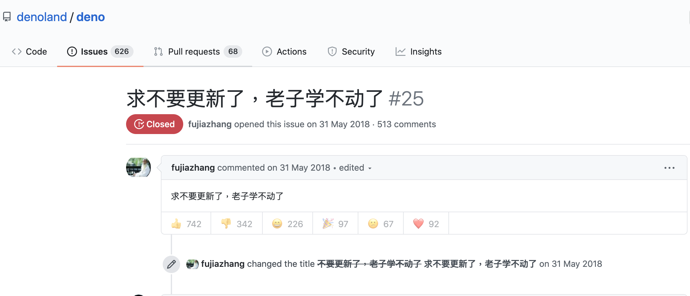

2018年Node.js 開發之父在JSconf 2018 點評了十個 Node.js 的設計錯誤，並提出了一個終極解決方案 - [Deno](https://github.com/ry/deno/tree/5c7ba22f2242930ad09f011eaea12a59153e294f/deno2)  
Deno當時在中國引起了一波熱烈的討論，因為有一個很皮的工程師發了一個[issue #25](https://github.com/denoland/deno/issues/25)

有道是**逆水行舟，不進則退**。
- 前4年，你告訴我不會用jQuery，我會跟你說：實在抱歉…
- 前2年，你告訴我只會用jQuery，我會跟你說：實在抱歉…
- 現在，你告訴我會用Vue，我會問你：了解Vue3嗎？沒了解，實在抱歉…
- 明年，你告訴我只用過Vue2.x，我會跟你說，實在抱歉…

# Why Vue?
Vue.js（讀音 /vjuː/, 類似於 view） 是一套構建用戶界面的 漸進式框架。與其他重量級框架不同的是，Vue 採用自底向上增量開發的設計。 Vue 的核心庫只關注視圖層，並且非常容易學習，非常容易與其它庫或已有項目整合。另一方面，Vue 完全有能力驅動採用單文件組件和 Vue 生態系統支持的庫開發的複雜單頁應用。

總結一下，Vue具有以下特性，總有一個吸引你：
- 漸進式框架
- 自底向上增量開發的設計
- 平滑的學習曲線
- 官方提供簡潔易用的腳手架工具 vue-cli
- 代碼標準化利於團隊開發
- 官方文件提供中文文檔，有廣大的中文社群支持

# Why Vue3?
- 兼容 Vue2.x 95% 以上特性。
- 對 Ts 支持更加友好，更加迎合了行業趨勢、技術潮流
- Composition API 的添加，提供了 Best Practice
- 不用再擔心它還是一個從零開始的個人項目

# 哪些人適合學Vue3
1. 已掌握HTML CSS JAVASCRIPT基礎，準備挑選前端框架
2. 專案需要前端頁面，沒有專職前端成員可幫忙
3. 已學會Vue2.x，準備升級Vue3.0

# Vue2.x沒必要升級
如果是專案項目已經用Vue2.x在開發，那麼沒必要從 Vue2.x 升級到 Vue3.0。  
理由是：
1. Vue2生態中的幾個庫都面臨巨大升級，以及升級後的諸多坑要填，比如：vue-router、vuex、ElementUI/ViewUI/AntDesignVue 等。這些生態在 2.x 上都已經很成熟，但是在 3.x 上還有很多長路要走，很多坑要踩。
2. Vue3 為了實現 tree shaking，沒有了默認對象 export default，項目中所有直接使用 Vue.xxx 的語法全部得重寫，
3. CI/CD和發佈平台都需要全面升級，開發工具也可能面臨到新舊版本兼容和整合的問題。

# 學習資源
## 官方教程
英文 v3-beta
[https://v3.vuejs.org/guide/introduction.html](https://v3.vuejs.org/guide/introduction.html)  
簡中 v2
[https://cn.vuejs.org/v2/guide/](https://cn.vuejs.org/v2/guide/)
## Vue Mastery
[Vue Mastery](https://www.vuemastery.com) 是一個不錯的教學網站，同時提供[Vue3課程](https://www.vuemastery.com/courses-path/vue3)

此外還有Vue 3 Cheat Sheet ，簡單厄要地描繪了 Vue3 主要特性，同學可以借此資源快速上手。  

[Vue-3-Cheat-Sheet](https://www.vuemastery.com/pdf/Vue-3-Cheat-Sheet.pdf)   
[Vue-Essentials-Cheat-Sheet](https://www.vuemastery.com/pdf/Vue-Essentials-Cheat-Sheet.pdf)  
[Nuxtjs-Cheat-Sheet](https://www.vuemastery.com/pdf/Nuxtjs-Cheat-Sheet.pdf)
