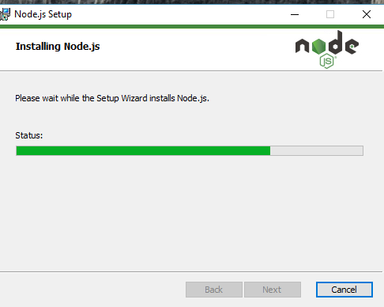

Node.js是一個基於Chrome V8引擎的javascript的運行環境，其特點是單線程、事件驅動，非阻塞I/O模型，非常輕便高效，其包管理工具npm，是全球最大的開源庫生態系統。

## Node.js簡介
在開發前端專案的時候，一般都是基於node.js的環境。因為Node.js能夠提供很好的開發基礎和包管理，Node.js的優點具體如下。
- 組織方便  
    JavaScript沒有模塊化組織代碼的能力。 
     
    在一個項目中，JavaScript通常會被分割到不同的文件中，如果採用以往的方式，處理起來將會非常頭終，現在利用Node.js的模塊進行管理，可以讓你輕鬆組織代碼。
- 資源廣泛  
    Node.js的出現讓JavaScript第三方包像雨後春筍一樣遍地開花。如果需要什麼，只要一條命令，Node.js 就能幫您辦理了，這一點帶來了極大的便利。
- 全棧處理:  
    開發完後還有很多事情要做，比如，要對前端代碼JavaScript或CsS文件進行合併、壓縮、混淆，以及項目部署等。  
    體驗過Ruby on Rails一鍵部署功能的小夥伴，都會對其印象深刻。Node.js也很容易優能做到這點，而且更加自然、流暢。  
    總之，有了Node.js，我們就可以像開發後台程序一樣組織前端代碼和項目了; 有了Node.js，就可以利用它背後強大的技術社區支持。  

## Node.js安裝與配置
首先，我們將向大家介紹Node.js的安裝方法，Node.js將會在之後的Vue3項目管理發揮作用，舉凡vue-cli、webpack等工具我們都會用npm進行安裝配置。

> Vue CLI需要Node.js 8.9或更高版本(推薦8.11.0+)，你可以使用nvm或nvm-windows在同一台電腦中管理多個Node版本。  
> 假使在環境配置過程中發生不可預期的錯誤，可以試著將Node.js降級後再試第二次。 

本安裝教程以 Node.js 12.18.3 LTS版本為例。  
Node.js的官方網站為:[https://nodejs.org/en/download/](https://nodejs.org/en/download/)  
你可以根據你的作業系統選擇Node.js安裝包。  


或是根據需求安裝特定版本的Node.js  
Node.js歷史版本下載地址： [https://nodejs.org/dist/](https://nodejs.org/dist/)

### 在 Windows 上安裝Node.js
1. 從官網下載所需要的安裝包  

2. 雙擊下載好的安裝包，並點擊run，會進到Node.js的安裝界面，點擊下一步  

3. 勾選“我同意協議“，點擊下一步  

4. Node.js默認安裝路徑為 "C:\Program Files]nodejs\"，有想要更改就點擊Change，路徑確定後就點擊下一步  

5. 點擊圖示來選擇你需要的安裝模式，然後點擊下一步  

6. 安裝Node.js中，需要等待一段時間  

7. 安裝完成，如果出現錯誤訊息就返回步驟2重新再走一次安裝過程  


#### 檢查Node是否安裝成功
檢查Node.js是否安裝成功以及PATH環境變數是否配置了Node.js。  
點擊開始->執行->輸入"cmd"並打開->輸入 node --version，你應該會看到以下訊息：
```
C:\>node --version
v12.18.3
```
假使出現 node' is not recognized as an internal or external command operable program or batch file，可能是PATH沒配置成功，需要在cmd裡輸入以下指令
```
// C:\Program Files\Nodejs 自行代換成你自己的Nodejs安裝路徑
C:\>set PATH=%PATH%;C:\Program Files\Nodejs
```
### 在 Linux 上安裝Node.js
#### Ubuntu apt-get命令安裝
執行安裝命令如下
```
$ sudo apt-get install -y nodejs npm
```
#### 直接下載官方已編譯好的包
```
// 下載
$ wget https://nodejs.org/dist/v10.9.0/node-v12.18.3-linux-x64.tar.xz 
// 解壓縮
$ tar xf node-v12.18.3-linux-x64.tar.xz
// 進入解壓縮的資料夾
$ cd node-v12.18.3-linux-x64/
// 執行node命令 查看版本
$ ./bin/node -v
v12.18.3
```
解壓文件的bin資料夾裡包含了node和npm等命令，我們可以使用ln命令來設置軟連接：
```
# /usr/software/nodejs 自行代換成你自己的解壓縮後的路徑
ls -s /usr/software/nodejs/bin/node /usr/local/bin/
ls -s /usr/software/nodejs/bin/npm /usr/local/bin/
```
### 在 Mac OS 上安裝Node.js
Mac使用者可以選擇以下兩種方式在Mac OS上安裝node:
1. 在官方網站下載pkg安裝包，直接點擊安裝
2. 使用 brew 命令來安裝：
```
brew install node
```
