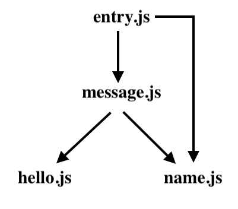
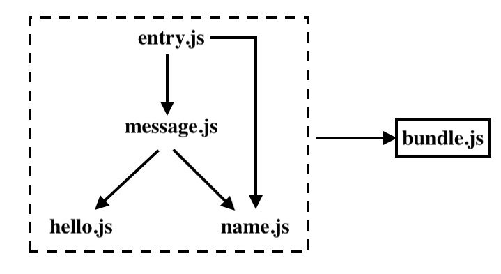

網頁(Web Page)進化成網頁應用程式(Web Application, 以下簡稱Web App)會具現以下特點：
- 更多的JavaScript
- 更多的用戶界面
- 網頁在提供服務的過程中，盡可能少刷新整個頁面

現在的網站有非常多代碼在客戶端運行，瀏覽器端承載的工作份量越來越重，並且出現多文件、多人協作的情況，龐大的代碼庫需要被有序地管理起來，將某些功能完善的代碼抽離出來成為獨立的單元，可以被其他單元引用，這就是模塊化。

# 什麼是打包
舉個例子，你在一個html文件中引入多個JavaScript文件
```html
<html>
<script src="/src/entry.js"></script>
<script src="/src/message.js"></script>
<script src="/src/hello.js"></script>
<script src="/src/name.js"></script>
</html>
```
這四個引入文件之間存在如下依賴關係：  

在引用時還要特別注意文件的依賴關係，如果你把它們的引用順序顛倒就會報錯，在大型項目中，這種依賴關係就顯得尤其重要，而且極難維護，除此之外，它還有以下問題：
- 一切都加載到全局上下文中，導致名稱衝突和覆蓋
- 涉及開發人員的大量手動工作，以找出依賴關係和包含順序

另外，當瀏覽器打開該網頁時，每個 js 文件都需要一個單獨的 http 請求，在此範例中，我們需要 4 個往返請求，才能啟動項目。
我們知道瀏覽器加載模塊很慢，即使是 HTTP/2 支持有效的加載許多小文件，但其性能都不如加載一個更加有效（即使不做任何優化)。
因此，最好將所有 4 個文件合併為1個：  

通過打包(Bundle)，我們將 http 請求次數減低到一次，也避免了文件是否依照順序引用的問題。

# 什麼是Webpack
Webpack是一個現代JavaScript應用程序的靜態模塊打包器(module bundler)。它的功用是把前端開發時用到的諸多靜態資源打包，如JavaScript、CSS和圖片等檔案。  


## webpack 核心概念
### Entry 
入口起點(entry point)指示 webpack 應該使用哪個模塊,來作為構建其內部依賴圖的開始。  
默認值是./src/index.js，但你也可以自行配置 [webpack configuration](https://webpack.docschina.org/configuration) 來指定一個(或多個)不同的入口起點。  
進入入口起點後,webpack 會找出有哪些模塊和庫是入口起點（直接和間接）依賴的，每個依賴項隨即被處理，最後輸出到稱之為bundles的文件中。  
### Output 
output 屬性告訴 webpack 在哪里輸出它所創建的 __bundles__ ,以及如何命名這些文件,生成文件默認存放路徑為 ./dist 文件夾中。
基本上,整個應用程序結構,都會被編譯到你指定的輸出路徑的文件夾中。
### Module 
模塊,在 Webpack 里一切皆模塊,一個模塊對應著一個文件。Webpack 會從配置的 Entry 開始遞歸找出所有依賴的模塊。
### Chunk 
代碼塊,一個 Chunk 由多個模塊組合而成,用於代碼合並與分割。
### Loader 
loader 讓 webpack 能夠去處理那些非 JavaScript 類型的文件（webpack 自身只理解 JavaScript和JSON 文件）。  
loader 可以將所有類型的文件轉換為 webpack 能夠處理的有效模塊,然後你就可以利用 webpack 的打包能力,對它們進行處理。  
本質上,webpack loader 將所有類型的文件,轉換為應用程序的依賴圖（和最終的 bundle）可以直接引用的模塊。  
### Plugin 
loader 被用於轉換某些類型的模塊,而插件則可以用於執行範圍更廣的任務。
插件的範圍包括,從打包優化、資源管理和注入環境變量。插件接口功能極其強大,可以用來處理各種各樣的任務。

# Vue-cli
Vue-cli是官方提供的腳手架工作，可以用於快速開發大型單頁應用程式，Vue-cli的是一些前端管理工具(Gulp、 Webpack...)的高階抽象，可透過指令快速地建立一個立即可用的Vue開發環境，不用花費大量時間去配置打包工具。

目前 Vue-cli 提供了六種基本樣板：
- [webpack](https://github.com/vuejs-templates/webpack)
- [webpack-simple](https://github.com/vuejs-templates/webpack-simple)
- [browserify](https://github.com/vuejs-templates/browserify)
- [browserify-simple](https://github.com/vuejs-templates/browserify-simple)
- [pwa](https://github.com/vuejs-templates/pwa)
- [simple](https://github.com/vuejs-templates/simple)

webpack是目前vue-cli最多人使用的工具，包含熱加載(Hot reload)、語法檢查(Linting)、單元測試、CSS預編譯等功能，相對於其它樣板而言更適合搭建大型專案。
更多可參閱官方 GitHub : [https://github.com/vuejs/vue-cli](https://github.com/vuejs/vue-cli) 。

後續的Vue3教學，我們會使用Vue-CLI搭配Webpack來進行開發環境的配置。
