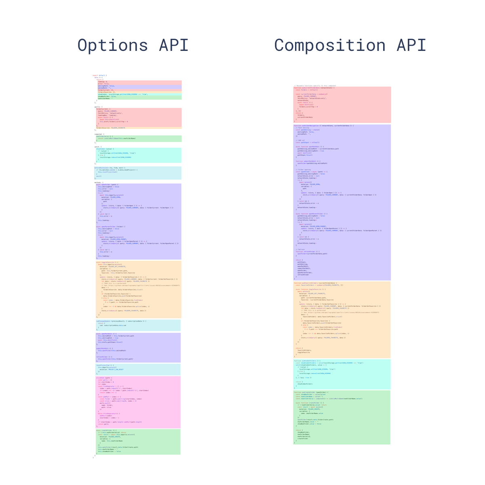
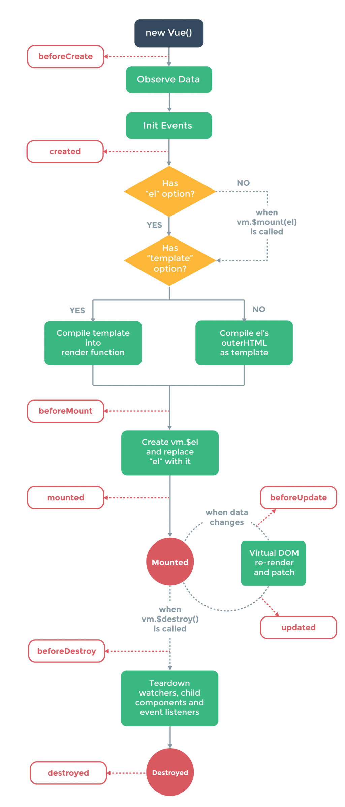

首先，我們先來看一下 Vue2 的 Options Api 於大規模網路應用程序中的侷限性，它主要存在著以下三個缺點：
- 大型組件很難維護
- 組件邏輯複用困難
- 對Typescript的支持有限

這是因為 Options Api是通過組件選項(data, methods, lifecycle等)撰寫的，而不是透過邏輯組織程序，隨著更多的組件選項添加以及程序庫的增長，一個帶有許多特性的大型組件在 Options API 的架構下，程序會散落在組件各處，變得十分笨拙且難以閱讀。

因此，為了解決上述問題， Vue3 引入了一個新的程序編寫方式： Composition API

對於初學者來說，原來很明確的程序編寫方式，現在全部都存放在 `stepup()` 一個方法裡頭，會不會更混亂？  
答案是肯定的，這也是作者在設計 Vue3 時的一個取捨。
> 他們相信：  
> 1.提高上限的收益大於降低下限的損失;  
> 2.通過良好的文件和社群的指導，可以高效地解決程序組織問題；

# Vue實例生命週期
Vue的生命週期在這裡不會詳盡的介紹，對於生命週期只要先有一個觀念，實例化的組件的數據和組件是分開管理的，一直到Mounted的階段Vue才會呼叫瀏覽器渲染畫面，後面的章節我們會在學習Vue的過程中，逐一介紹每個生命週期階段做的哪些事。

# 生命週期鉤子
Vue3 重命名了生命週期鉤子相關的API名稱，現在必須在生命週期鉤子加上 `on` 的前綴來訪問組件的生命週期鉤子。
下表展示了生命週期鉤子是如何在`setup()`內部調用的，順帶一提，由於`setup()`本身就是圍繞在beforeCreate和created之間運行的，因此你不需要再顯式調用這兩個生命週期鉤子。
Options API	    ->  Hook inside `setup`  
beforeCreate    ->  Not needed  
created	        ->  Not needed  
beforeMount	    ->  onBeforeMount  
mounted	        ->  onMounted  
beforeUpdate    ->  onBeforeUpdate  
updated	        ->  onUpdated  
beforeUnmount   ->  onBeforeUnmount  
unmounted       ->  onUnmounted  
errorCaptured   ->  onErrorCaptured  
renderTracked   ->  onRenderTracked  
renderTriggered ->  onRenderTriggered  

# Reference
1. [Vue 3 Composition API examples](https://github.com/ShetlandJ/Vue3Todo)

