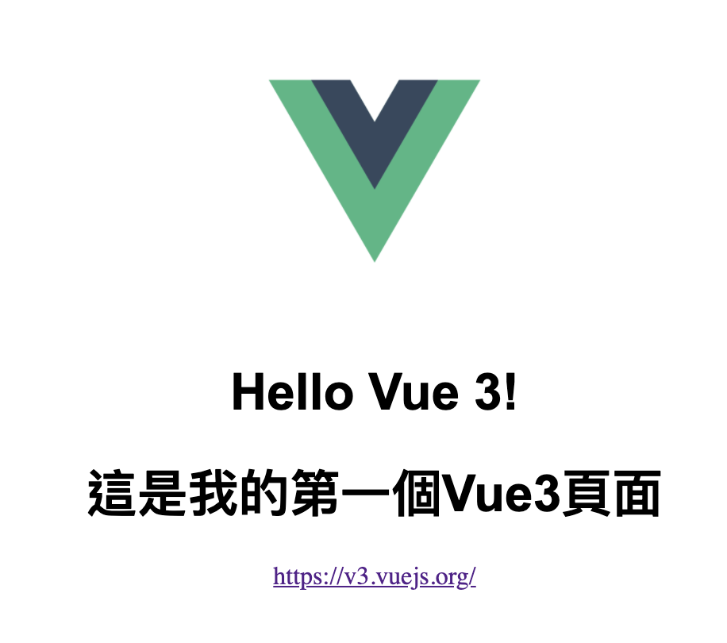


前面我們介紹過 Vue Composition API的組織結構，如何在 .vue 檔案寫進html、vue component和style，也教了怎麼配置Webpack去解析及打包我們的前端項目，一切就緒後就可以準備正式進入 Vue3 的世界了。

# 數據綁定
> Vue具有響應式的數據綁定系統，建立綁定之後，DOM將和數據保持同步，每當數據發生變化，DOM也會同步更新。

## 綁定方法
Vue3 數據綁定的方法很簡單，只有兩個步驟，第一步是在`<script>`區塊裡用setup()方法宣告變數並賦值，並且使用return返回該變數。 
```html
<script>
export default {
  setup() {
    const url="https://v3.vuejs.org/"
    const title="這是我的第一個Vue3頁面"
    return {
      url,
      title
    }
  }
}
</script>
```
第二步是在<template>區域使用  `{{ }}`Mustache標籤 引用該變數。
```html
<template>
  
  <h1>Hello Vue 3!</h1>
  <h1>{{title}}</h1>
  <a v-bind:href="url">{{ url }}</a>
</template>
```
以上兩步都完成後，數據綁定即完成，你可以在終端使用 `yarn dev` 指令啟動一個 `dev server` 查看數據綁定後的結果。


## 單次插值
假如你只想讓數據只在第一次被渲染後，之後就不會因為資料變動而重新渲染頁面，那麼可以使用單次插值。

單次插值的語法為在Mustache標籤的變數前加星號，例如 `{{*url}}`。

## 插入html
Mustache標籤的功能是將資料以字串的方式插入DOM樹，因此所有的html標籤都不會生效，假如你想插入的對象是一個html元件，而不是字串，你應該使用需要用三 Mustache 標籤。

例如：
```html
<template>
  
  <h1>Hello Vue 3!</h1>
  <!-- 現在會以一個html元件插入，而非字串-->
  <div>{{{title_html}}}</div>
</template>
<script>
export default {
  setup() {
    const title_html='<h1>這是我的第一個Vue3頁面</h1>'
    return {
      title_html
    }
  }
}
</script>
```
## Javascript表達式
Vue的數據綁定也支持Javascript表達式，因此以下的數據插入寫法都是有效的
```javascript
{{ number+1 }}
{{ ok?"YES":"NO" }}
{{ message.split('').reverse().join('') }}
```

# 練習
如何，數據綁定在Vue裡頭很簡單吧。
你可以試著在本地自己創建一個Vue3項目練習，或是點擊以下連結去CodesandBox練習。

