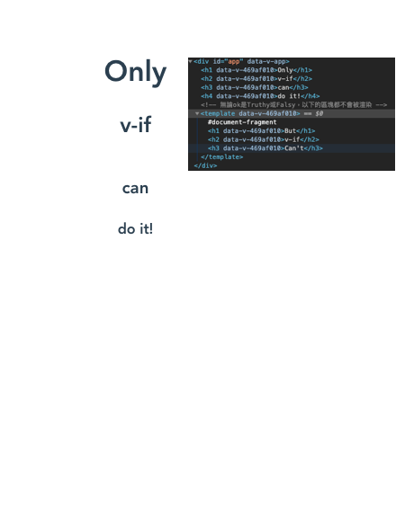
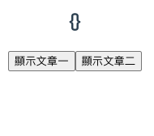
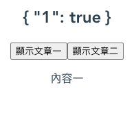
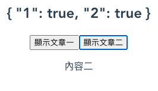

另一個條件式渲染的指令是`v-show`，它的語法和`v-if`雷同，都是根據跟隨其後的表達句的`Truthy`或`Falsy`來顯示或隱藏元素。

# 範例
```
<template>
    <div id="app">
        <span v-show="ok">條件式渲染 v-show</span>
    </div>
</template>
```
```
<script>
export default {
  setup () {
    const ok=true
    return {ok}
  }
}
</script>
```

# 適用場景
`v-if`是真正的條件渲染，它會根據條件的`Truthy`或`Falsy`去插入或銷毀 DOM 裡頭的元素。

相對來說，`v-show`不管條件為何，它總是渲染綁定的組件，並且透過 CSS樣式 `display:none` 的方式去控制組件的狀態是顯示或隱藏。

因此我們可以知道，`v-if`在條件切換時的成本較昂貴，適合運行時條件切換較少的情景。`v-show`則剛好相反，它適合需要頻繁切換的場景。

## Group Rendering
因為`v-show`不支援`<template>`語法，因此以下的`v-show`語法是無效的。
### 原始碼
```
<template >
  <template v-if="ok">
    <h1>Only</h1>
    <h2>v-if</h2>
    <h3>can</h3>
    <h4>do it!</h4>
  </template>
  <!-- 無論ok是Truthy或Falsy，以下的區塊都不會被渲染 -->
  <template v-show="ok">
    <h1>But</h1>
    <h2>v-if</h2>
    <h3>Can't</h3>
  </template>
</template>

<script>
export default {
  setup () {
    const ok=true
    return {ok}
  }
}
</script>
```
### 網頁渲染結果


### 解決辦法
1. 改用`v-if`
2. 用塊級元素`div`取代`template`做包裏的動作。
```
  <div v-show="ok">
    <h1>You</h1>
    <h2>can</h2>
    <h3>see</h3>
  </div>
```

# 組合技
在某些情況下，我們會想要擁有`v-if`和`v-show`兩者的優點，並且最小化兩者在渲染上的開銷。  

這種時候，我們可以將`v-if`和`v-show`組合起來：用`v-if`做初始化的渲染，避免`v-show`總是渲染全部組件的開銷，當條件變動時則讓`v-show`接手控制，而不是讓`v-if`銷毀組件。
這聽起來很棒，對不對？藉由兩者的組合，我們同時擁有了兩個的優點，也避掉了兩個各自的缺點。

為了達到上述的效果，我們需要一個額外的資料結構，並且改造一下`v-if`的條件判斷，讓它在無資料時為 `Falsy` ，第一次創建後就永遠為`Truthy`。
```
<template >
    <h2>{{articles}}</h2>
    <button @click="storeArticle(1)">顯示文章一</button>
    <button @click="storeArticle(2)">顯示文章二</button>
    <p v-if="state === 1 || articles[1]" v-show="state.index===1">內容一</p>
    <p v-if="state === 2 || articles[2]" v-show="state.index===2">內容二</p>
</template>

<script>
import {reactive} from 'vue'
export default {
  setup () {
    let state=reactive({index:0})
    const articles=reactive({})
    function storeArticle(index){
      state.index = index
          articles[index]=true
    }
    return {state,articles,storeArticle}
  }
}
</script>
```
## 渲染結果
頁面初始化

先點擊「顯示文章一」

先點擊「顯示文章二」

點擊「顯示文章一」再點擊「顯示文章二」


## 分析
在組合技中，我們同時用了`v-if`和`v-show`，`v-if`的功能是控制是否初始渲染，`v-show`的功能是控制是否顯示資料。

articles初始為空物件，每當使用者點擊按鈕時， storeArticle 的方法就會把資料存放到 articles 的物件裡頭，接著 `v-if` 和 `v-show` 會根據articles的內容和state的index去決定是否渲染與顯示HTML元素。

這種做法可以應用在ajax渲染或lazy load。
# 小結
- 條件式渲染可以用`v-if`或`v-show`
- `v-show`不支援`<template>`標籤
- `v-if`的切換成本較高，`v-show`的初始化成本較高


# 參考文獻
1. [透過v-if與v-show共用來節省渲染資源](https://guahsu.io/2018/08/vue-if-with-vue-show-singleton/)
2. [Conditional Rendering](https://v3.vuejs.org/guide/conditional.html)
