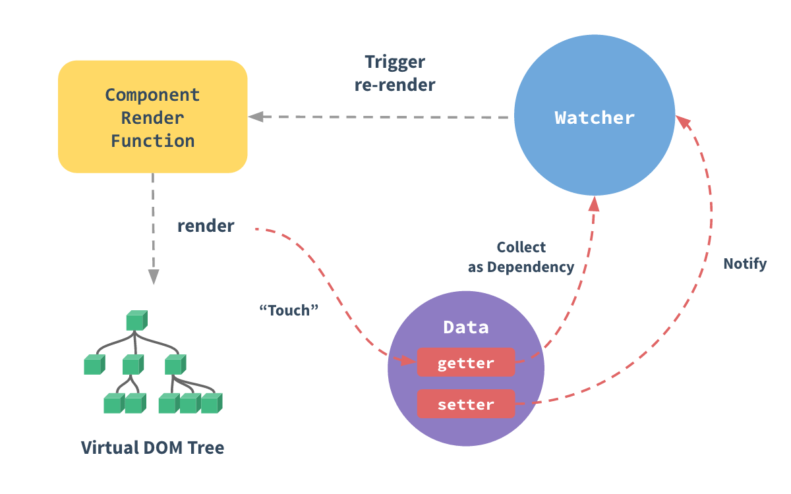
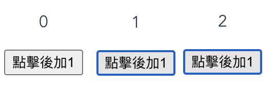
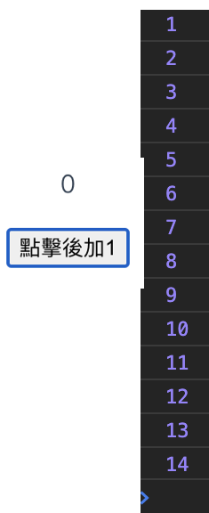

Vue.js 其中一個核心思想是數據驅動，它提供了一個 MVVM 風格的雙向綁定 Javascript 庫。所謂數據驔動是指視圖是根據數據生成的，開發者不用直接去操作 DOM 以及煩惱頁面的事件綁定，可以專注在前端的邏輯與數據管理。此外 Vue 還會對操作進行監聽，當視圖發生改變時，Vue監聽到這些變化，會對數據進行相應的修改，從而形成了數據的雙向綁定。
> MVVM  是 Model-View-ViewModel 的縮寫，它是一種基於前端開發的架構模式，其核心是提供對 View 和 ViewModel 的雙向數據 綁定，這使得 ViewModel 的狀態改變可以自動傳遞給 View ，即所謂的數據雙向綁定。


# Vue2 響應式原理回顧
根據官方文件對於響應式原理的 [介紹](https://vuejs.org/v2/guide/reactivity.html#ad) ，簡單總結如下：
1. VUe2 的數據響應原理是由 JS 標準內置對象方法 Object.defineProperty 來實現的 (這個方法不兼容 IE8 和 FF22 以下的瀏覽器)
2. 任何一個Vue Component 都會有一個與之對應的 Watcher 實例。
3. Vue 的 data裡的屬性會被添加 getter 和 setter 屬性。
4. 當 Vue component render 函數 被執行時， data 會被觸碰，進而調用 getter 方法，此時 Vue 會去記錄此 Vue component 所依賴的所有 data (此過程被稱為依賴收集)。 
5. 當 data 被改動時， setter 方法會被調用，此時 Vue 會去通知所有依賴於此 data的組件去調用他們的 render 函數進行更新。



## Vue2 響應式的缺點
- 遞歸，消耗大
- 新增/刪除屬性需要另外實現API
- 陣列需要另外實現
- Map、Set、Class等資料類型，無法響應式
- 修改語法有限制

# Vue3 響應式方案
採用 ES6 的 Proxy 進行響應式，Proxy可以在目標對象上加一層攔截/代理，外界對目標對象的操作都會經過這一層攔截。

相較於 Object.defineProperty ，Proxy支持更全面的對象操作： get, set, has, deleteProperty, ownKeys, defineProperty…等。

# [為什麼畫面沒有隨資料更新](https://pjchender.blogspot.com/2017/05/vue-vue-reactivity.html)
答案只有一個：沒有正確的宣告響應式data。

在 Vue2，只有 data() 裡的屬性於初始化中被設置 getter 及 setter，其他區塊裡宣告的變數不會。如果是動態新增資料，則必須呼叫正確的API，否則 Vue 無法監控到資料是否更新，當然就無法通知調用 render 函數渲染新的畫面。

在 Vue3 則是提供了新的API用以宣告響應式，它們分別是 `ref`和`reactive`。

# ref
`ref`提供了將以下七種主要的Javascript資料型態變成響應式，如果你需要以下的資料型態作為數據驅動，`ref`會是一個好選擇：
- String
- Number
- BigInt
- Boolean
- Symbol
- Null
- Undefined

## 範例
以下是一個計數器的例子，頁面渲染後，每點擊按鈕一次，計數器都會加一。
```
<template>
  <div>
    <span>{{ count }}</span>
    <button @click="count ++">點擊後加1</button>
  </div>
</template>
<script>
import { ref } from "vue";

export default {
  setup() {
    const count = ref(0)
    return {count}
  }
};
</script>
```

## 錯誤的使用
以下是一個錯誤的例子，我們對count變數進行了數據綁定，同時也宣告了一個onClick變數，每按下按鈕就會使count增加1，但是不管我們按幾下按鈕，頁面總是顯示 0 ，console的輸出卻又顯示了count的數值確實有增加。

這就是因為我們沒有把count變數宣告為響應式，因此vue並不會監測資料是否變動而去重新渲染畫面。
```
<template>
    <span>{{ count }}</span>
    <button @click="onClick">點擊後加1</button>
</template>
<script>
export default {
  setup() {
    let count = 0
    function onClick()=>{count++;console.log(count)}
    return {count,onClick}
  }
};
</script>
```

# ref的機制
在前面的範例中，我們使用了`const`關鍵字宣告了count的響應式，這是因為`ref`會根據我們傳入的參數返回一個 `ref Object`，該物件只會有一個`.value`屬性，每當你要獲取或修改資料時，就可以使用`object.value`去讀取或更新數值。

由於它是個Object，因此我們宣告時可以用`const`關鍵字，
```javascript
{_isRef: true}
value: (...)
_isRef: true
get value: ƒ value()
set value: ƒ value(newVal)
__proto__: Object
```

# ref 自動展開
另一個問題是我們為什麼不用在樣板裡使用`.value`進行數據綁定？
```
<template>
    <span>{{ count }}</span>
</template>
```
這是因為當 render 函數渲染上下文時，它會自動展開 `ref` 物件的 `.value`，因此你不用在template顯式呼叫`object.value`就可以進行數據綁定。

`computed`函數同樣具有自動展開ref的功能，同樣的你可以在`computed`裡頭直接呼叫`ref`物件。

# reactive
假使你想要的是一個響應式物件，而不是主要資料型態的響應式變數， `reactive` 將會是你需要的，它接受一個Object，並且會回傳一個響應式的物件。

舉例來說，上述的ref範例可以用reactive改寫：
```
<template>
  <div>
    <span>{{ state.count }}</span>
    <button @click="state.count ++">點擊後加1</button>
  </div>
</template>
<script>
import { reactive } from "vue";

export default {
  setup() {
    const state = reactive({count:0})
    return {state}
  }
};
</script>
```
`reactive`和`ref`最大的差異，是`ref`在template會自動展開，可以省略`.value`的書寫，而`reactive`可能包含多個屬性，因此一定要像範例般明確地指定，如`state.count`。

# ref 或 reactive的使用選擇
那麼我們何時使用`ref`，什麼情境使用`reactive`呢？

一切取決於開發者組織代碼的方式，上述點擊器的範例，我們宣告了一個count變數的響應式資料，儲存的是單一主要資料類型，因此使用`ref`會比`reactive`更佳。

假設今天我們要建立一個使用者頁面，使用者有：姓名、性別、年齡、電話、vip等屬性，我們有兩個選擇，第一是用`ref`分別宣告每個屬性
```
<script>
import { ref } from "vue";

export default {
  setup() {
    const name=ref('')
    const gender=ref('')
    const age=ref(0)
    const phone=ref('')
    const vip=ref(true)
    return {name,gender,age,phone,vip}
  }
};
</script>
```
又或者我們可以使用`reactive`宣告一個響應式的user物件
```
<script>
import { reactive } from "vue";

export default {
  setup() {
    const user=reactive({
                name:'',
                gender:'male',
                age:18,
                phone:'',
                vip:true
                })
    return {user}
  }
};
</script>
```
前一種適合展示單一會員資料頁面，由於ref具有自動展開的功能。我們在template中可以省去不必要的前綴，直接使用`name`、`gender`或`age`等。

後一種適合會員列表，你可以配合陣列使用，列表式的渲染每一個`user`資料。

一切取決看你的需求，沒有哪一種寫法一定更好。

# 小結
在本章中，你學到了
- 響應式原理
- Vue2的響應式和Vue3的響應式實現方案
- ref & reactive
- 錯誤的響應式宣告(為什麼畫面沒有隨資料更新)
# 參考文獻
1. [declaring reactive state](https://v3.vuejs.org/guide/reactivity-fundamentals.html#declaring-reactive-state)
2. [reactive vue 3 state](https://dzone.com/articles/reactive-vue-3-state)
3. [為什麼畫面沒有隨資料更新](https://pjchender.blogspot.com/2017/05/vue-vue-reactivity.html)
4. [vue3 ref vs reactive](https://www.danvega.dev/blog/2020/02/12/vue3-ref-vs-reactive/)
