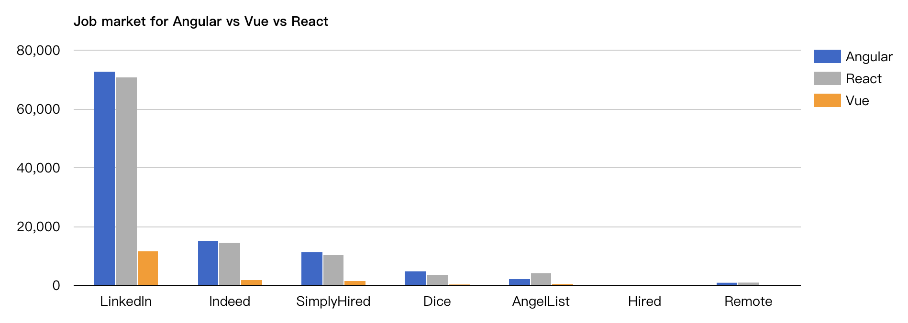

這篇文章是一個全面的指南，告訴你哪個才是最適合你的解決方案: **Angular vs React vs Vue**。

就在幾年前，開發人員還在爭論他們的項目應該使用Angular還是React。但在過去的幾年裡，我們看到了對第三家公司Vue.js的興趣有所增長。

如果您是一個剛開始開發項目的開發人員，卻難以決定使用哪個JavaScript框架作為項目的開發基礎，那麼本指南將幫助您做出決定。

我們會從不同角度去分析Angular、React和Vue這三個框架，看看它們如何滿足您的需求。這篇文章不只是關於Angular、React和Vue的指南，而是旨在提供一個結構來幫助判斷前端JavaScript框架。如果明年有新的框架出現，您將確切地知道需要查看哪些參數!

在這篇文章中，我們假設你有JavaScript的基本知識，並使用過JavaScript框架。

# 目錄

Part 1: [Vue、React和Angular的簡要歷史](./2021-05-07-vue-react-angular-comparision.md#第1部分:Vue、React和Angular的簡要歷史)  
[這一切是如何開始的](##這一切是如何開始的) 🐣 | [許可證](##許可證) 👮‍♂️ | [熱門程度](##熱門程度) 🔥 | [就業市場](##就業市場) 👷‍♂️  
Part 2: [社群與發展](./2021-05-07-vue-react-angular-comparision.md#第2部分:社群與發展)  
Part 3: [遷移](./2021-05-07-vue-react-angular-comparision.md#第3部分:遷移)  
Part 4: [使用Vue vs Angular vs React](./2021-05-07-vue-react-angular-comparision.md#第4部分:使用Vue vs Angular vs React)  
[大小和加載時間](##大小和加載時間) ⏲️ | [組件](##組件) 🏗️ | [學習曲線](##學習曲線) 🎓  
[Angular vs React vs Vue:誰贏了?](#Angular vs React vs Vue:誰贏了?)

# 第1部分:Vue、React和Angular的簡要歷史

在我們進入技術細節之前，為了更好地理解這些框架的哲學和它們隨時間的演變過程，讓我們先談談它們背後的歷史發展。

## 這一切是如何開始的


Angular由谷歌開發，於2010年首次發布，是三個框架中歷史最悠久的一個。它是一個基於類型的JavaScript框架。在2016年Angular 2發布的時候發生了重大的變化(去掉了原來名為AngularJS的“JS”)。
Angular 2+就是Angular。儘管AngularJS(版本1)仍在更新，我們將集中討論Angular。最新的穩定版本是Angular 11，它於2020年11月發布。


React由Facebook開發，最初於2013年發布。 Facebook在其產品(Facebook、Instagram和WhatsApp)中廣泛使用React。當前的穩定版本是17.X，於2020年10月發布(此後進行了較小的增量更新)。


Vue，又稱為Vue.js是組合中最年輕的成員。它是由前谷歌員工Evan You在2014年開發的。在過去的三年裡，儘管Vue沒有大公司的支持，但它的受歡迎程度已經有了很大的轉變。目前的穩定版本是3.0，於2020年9月發布(
此後會有一些小的增量發布)。 Patreon支持Vue的貢獻者。 需要注意的是，Vue 3目前處於自己的GitHub repo中，並且已經轉移到TypeScript中。

以下是Angular、React和Vue在地位和歷史方面的簡短總結:

|~|Angular|React|Vue|
|:---:|:---:|:---:|:---:|
|初始版本|2010年|2013年|2014年|
|官方網站|[angular.io](angular.io)|[reactjs.org](reactjs.org)|[vuejs.org](vuejs.org)|
|容量大約(KB)| 500| 100| 80|
|當前版本|9| 16.x|3.0.0|
|使用公司|谷歌、wix|facebook、優步|阿里巴巴、GitLab|

## 許可證

在使用開放源碼框架之前，請確保通過其許可。有趣的是，這三個框架都使用[MIT License](https://opensource.org/licenses/MIT)
，它對重用提供了有限的限制，即使在專有軟件中也是如此。在使用任何框架或軟件之前，請確保了解許可的含義。

## 熱門程度

由於“angular”和“react”是常用詞，從谷歌的趨勢中很難把握它們的流行度。儘管如此，他們的[GitHub存儲庫獲得的星星數量](https://star-history.t9t.io/#facebook/react&vuejs/vue&angular/angular)
可以很好地說明他們的受歡迎程度。 Vue的星星數量在2016年年中發生了劇烈的變化，最近，Vue已經和React一起成為了最受歡迎的框架。   


## 就業市場

接著我們來看看Angular、React和Vue的就業市場情況，這也是衡量受歡迎程度的一個好指標:  
最好的[資料來源](https://zerotomastery.io/blog/tech-trends-showdown-react-vs-angular-vs-vue/)  各種各樣的工作公告板表明了就業市場的趨勢。  
  
從2018年末的趨勢來看，需要Angular或React技能的職位數量大致相同，而Vue的職位仍然只是這個數字的一小部分(約20%)。

如果您想要一個更最新的分析，您可以嘗試這個[谷歌趨勢搜索](https://trends.google.com/trends/explore?cat=31&q=Vue%20jobs,React%20jobs,Angular%20jobs)
，它將過去12個月的搜索趨勢分為React工作、Angular工作和Vue工作。數據如下:  


如果你想了解你所在地區的求職趨勢，谷歌Trends還將其按地理位置進行了細分。

嚴格地從當前就業市場的角度來看，你最好的選擇是學習Angular或者React。然而，考慮到Vue在過去三年中已經流行起來，使用Vue的項目或採用Vue的新項目可能需要一些時間才能達到要求更多開發人員的成熟級別。

# 第2部分:社群與發展

現在您已經熟悉了每個框架的歷史和最近的趨勢，我們將查看社區以評估這些框架的開發。我們已經看到，在過去的一年中，所有框架都定期發布增量版本，這表明開發正在全面展開。

讓我們來看看Angular、React和Vue在GitHub庫中的統計數據(注意： Vue的數字也包括單獨的Vue 3.0庫):

|~|Angular| React| Vue|
|---|---|---|---|
|Watchers| 3.2k |6.7k |6.3k
|Stars |70.9k |164k |200.8k|
|Forks| 18.6k |32.9k |31.7k|
|Contributors |1,352 |1,533 |382|

當比較Vue和React時，Vue有大量的觀察者、星星和fork。這顯示了Vue在用戶中的受歡迎程度和相對於React的價值。然而，Vue的貢獻者數量低於Angular和React。

一種可能的解釋是，**Vue完全是由開源社區驅動的**，而Angular和React有很大一部分貢獻來源於谷歌和Facebook員工。

從統計數據來看，所有三個項目都顯示了顯著的開發活動，而且這肯定會在未來繼續下去——僅僅是這些統計數據不可能成為決定使用其中任何一個的基礎。

您需要考慮的另一個指標是GitHub的[“Used By”標記](https://twitter.com/github/status/1131468413983961088)
，它需要由存儲庫作者啟用。這顯示了GitHub上有多少其他存儲庫依賴於該存儲庫。 Angular的GitHub
repo顯示170萬，React目前顯示了將近570萬，而Vue兩個repo加起來顯示了超過16.7萬。這三個框架之間有很大的不同，但這很大程度上是由於Vue是較新的框架，並且不能反映總體需求的全貌。

# 第3部分:遷移

當您使用您所選擇的框架時，您不希望不得不擔心即將到來的框架更新會搞亂您的代碼。儘管在大多數情況下，從一個版本到另一個版本，您不會遇到很多問題，但一定要保持謹慎，因為有些更新可能更重要，需要調整以保持兼容性。

Angular計劃每六個月進行一次[重大更新](https://angular.io/guide/releases) 。在任何主要api被棄用之前還有6個月的時間，這給了您兩個發布週期(一年)來進行必要的更改(如果有的話)。

進一步對Angular和React兩者比較，Facebook表示[穩定性對他們來說是最重要的](https://reactjs.org/docs/design-principles.html#stability)
，就像Twitter和Airbnb這樣的大公司一樣。React提供了像[response-codemod](https://github.com/reactjs/react-codemod)
這樣的腳本可以幫助您進行遷移，因此在版本升級的需求裡React是三者中最容易的。

在FAQ的遷移部分，Vue提到，如果從[1.x開始遷移到2](https://vuejs.org/v2/guide/migration.html)
其中有90%的API是相同的。控制台上有一個[遷移幫助工具](https://github.com/vuejs/vue-migration-helper) 可以評估應用程序的狀態。

# 第4部分:使用Vue vs Angular vs React

這裡有幾個重要的特徵需要注意，主要是總體大小和加載時間、可用的組件和學習曲線。

## 大小和加載時間

Library的大小如下:

- Angular 4+:取決於生成的bundle大小
- React:116 KB
- Vue: 91 KB

雖然框架的大小有很大的差別，但與網頁的平均大小(根據[最近的數據](https://httparchive.org/reports/page-weight?start=2020_01_01&end=latest&view=list)
大約2MB)
相比，它們仍然很小。另外，如果你使用一個[流行的CDN](https://www.codeinwp.com/blog/maxcdn-vs-cloudflare-vs-cloudfront-vs-akamai-edge-vs-fastly/)
來加載這些庫，用戶很可能已經在他們的[本地系統](https://www.codeinwp.com/blog/local-wordpress-development-tools/) 中加載了這些庫。

## 組件

組件是這三種框架不可或缺的組成部分，無論我們討論的是Vue、React還是Angular。組件通常獲取輸入，並基於輸入更改行為。這種行為變化通常表現為頁面某些部分UI的變化。組件的使用使得重用代碼變得很容易。組件可以是電子商務站點上的購物車，也可以是社交網絡上的登錄框。

### Angular:

在Angular中，組件被稱為[指令](https://angular.io/api/core/Directive)
。指令只是DOM元素上的標記，Angular也可以跟踪並附加特定的行為。因此，Angular將組件的UI部分作為HTML標籤的屬性分離出來，並將其行為以JavaScript代碼的形式分離出來。這就是Angular和React的區別。

### React:

有趣的是，React結合了UI和組件的行為。例如，下面是在React中創建hello world組件的代碼。

```javascript
ReactDOM.render(
    <h1>Hello, world!</h1>,
    document.getElementById('root')
);
```

在React中，代碼的同一部分負責創建UI元素並規定其行為。

### Vue:

在研究Vue和React時，在Vue中，UI和行為也是組件的一部分，這使得事情更加直觀。另外，Vue是高度可定制的，允許您在腳本中組合組件的UI和行為。此外，還可以在Vue中使用[預處理器](https://vue-loader.vuejs.org/guide/pre-processors.html#sass)
，而不是CSS，這是一個很好的功能。 Vue在與其他庫(
如[Bootstrap](https://www.codeinwp.com/blog/best-vuejs-admin-templates-built-with-bootstrap/) )集成時非常出色。

> 為了比較使用不同庫的相同應用程序的外觀，這裡有一篇很棒的文章介紹[如何在React和Vue上創建相同的To do列表應用程序](https://medium.com/javascript-in-plain-english/i-created-the-exact-same-app-in-react-and-vue-here-are-the-differences-e9a1ae8077fd) ，並對比兩種框架的差異。

## 學習曲線

那麼學習這些框架有多難呢?

## Angular:

[Angular](https://angular.io/docs)
有一個陡峭的學習曲線，考慮到它是一個完整的解決方案，而掌握Angular需要你學習相關的概念，比如TypeScript和MVC。儘管學習Angular需要時間，但在理解前端如何工作方面，投資是有回報的。

## React:

React提供了一個[入門指南](https://reactjs.org/docs/getting-started.html) ，可以幫助你在一個小時內建立起React。文檔是徹底和完整的，與解決方案的常見問題已經出現在堆棧溢出。
React不是一個完整的框架，高級特性需要使用第三方庫。這使得核心框架的學習曲線不是那麼陡峭，而是取決於您使用附加功能的路徑。然而，學習使用React並不一定意味著您在使用[最佳實踐](https://americanexpress.io/clean-code-dirty-code/)
。

## Vue:

[Vue](https://vuejs.org/v2/guide/#Getting-Started) 提供了更高的可定制性，因此比Angular或React更容易學習。此外，Vue與Angular和React有功能上有重疊之處(
如組件的使用)。因此，從兩者之一過渡到Vue是一個簡單的選擇。然而，Vue的簡單性和靈活性是一把雙刃劍——它允許糟糕的代碼，使得調試和測試變得困難。

> 雖然Angular、React和Vue有一個顯著的學習曲線，但掌握它們之後，它們的使用是無限的。例如，你可以整合Angular，並與WordPress和WooCommerce一起創建進步的web應用。

# Angular vs React vs Vue:誰贏了?

在這篇文章的最後，讓我們回顧一下每個框架的特點，來回答以下問題:Angular vs React vs Vue:你應該選擇哪一個?


**Angular**
是最成熟的框架，在貢獻者方面有很好的支持，而且是一個完整的包。然而，學習曲線是陡峭的，Angular中的開發概念可能會阻礙新的開發人員。對於擁有大型團隊的公司和已經在使用TypeScript的開發人員來說，Angular是一個不錯的選擇。

Extra 這裡有一些[Angular管理儀表板模板](https://www.codeinwp.com/blog/best-angular-admin-dashboard-templates/) ,你可能會感興趣。


**React**已經足夠成熟了，並且有大量來自社區的貢獻。它得到了廣泛的接受。 React的就業市場真的很好，這個框架的未來看起來很光明。
對於剛開始使用前端JavaScript框架的人、初創公司和喜歡靈活性的開發人員來說，React看起來是一個不錯的選擇。與其他框架無縫集成的能力為那些希望代碼具有靈活性的人提供了巨大的優勢。


**Vue**是最新加入這個舞台的，沒有大公司的支持。

然而，在過去的幾年裡，它確實做得很好，成為了Angular和React的強大競爭對手。特別是隨著Vue 3.0的發布。許多中國巨頭，如阿里巴巴和百度，都選擇Vue作為他們的主要前端JavaScript框架。
如果您喜歡簡單性，但也喜歡靈活性，那麼應該選擇Vue。

Extra 這裡有一些[Vue的BootStrap管理模板](https://www.codeinwp.com/blog/best-vuejs-admin-templates-built-with-bootstrap/) 你可能感興趣。

# 尾聲

關於Angular、React和Vue之間爭論的答案是，沒有絕對正確的選擇，這可能是您所期待的結論。

每個庫都有自己的優點和缺點。根據你正在從事的項目和你個人的需求，其中一個會比其他的更合適。在做決定之前自己做一些調查研究是非常關鍵的，尤其是如果您是要從事商業開發而不是個人項目的話。

Angular vs React vs Vue，你認為哪個框架是贏家?請在下面的評論中告訴我們。

# 原始文章來源

[https://www.codeinwp.com/blog/angular-vs-vue-vs-react/](https://www.codeinwp.com/blog/angular-vs-vue-vs-react/)


